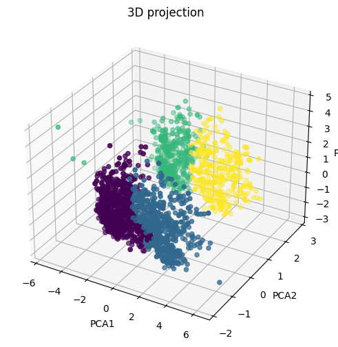
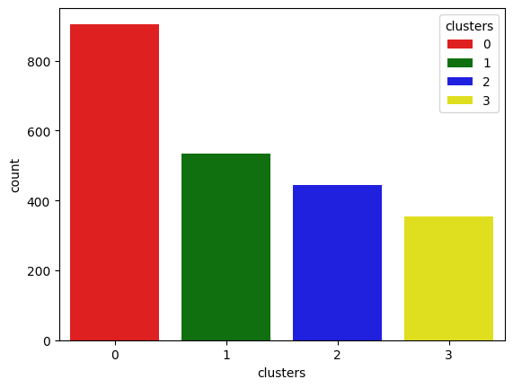
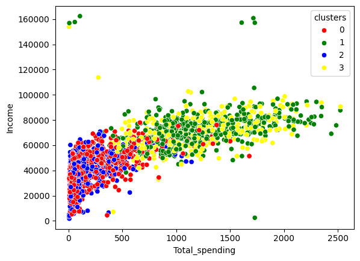

# Project: SmartCart-Segmentation-System

A smartcart-segmentation-system project build on Google Colab,
that is classifies customers into different clusters and help in identify customers,
on this basis of that shopping company take correct decision regrading to customer.

## Installation
- Python 3.x
- Google Colab
- Libraries: numpy, pandas, scikit-learn, matplotlib, seaborn

## Usage
1. Clone the repo:
   '''bash
   git clone https://github.com/Araw-kumar/SmartCart-Segmentation-System.git
2. Open the notebook in Google Colab.
3. Run all cells to train and test the model.

## Dataset
The dataset 'smartcart_customers.csv' is not stored in this repository (ignored via .gitignore).
You can download it from: [Kaggle Link](https://www.kaggle.com/datasets/mdadnan96/smartcart-customers-csv)

## Results / Output
Here is the 3D-Projection plot of the model:

Here is the Bar-plot of clusters and number of Customers:

Here is the Scatter-plot between Income and Total_Spending to analyse clusters:

Here is the Clusters_summary of model:

## Contributing
Pull requests are welcome. For major changes, please open an issue first.

